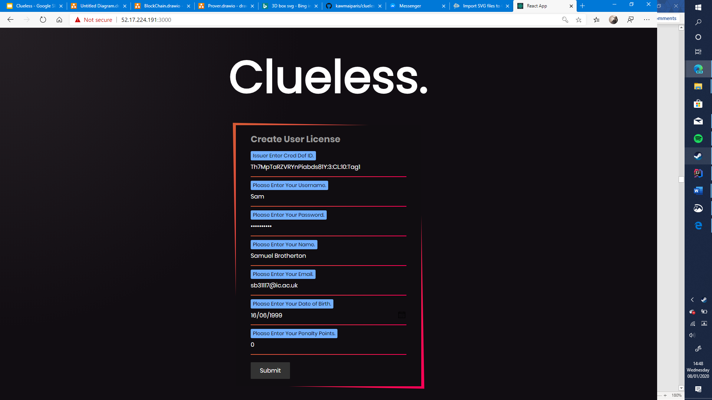
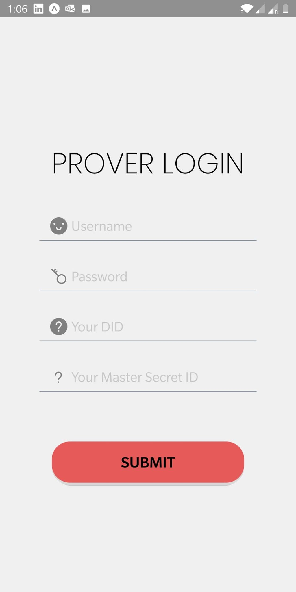
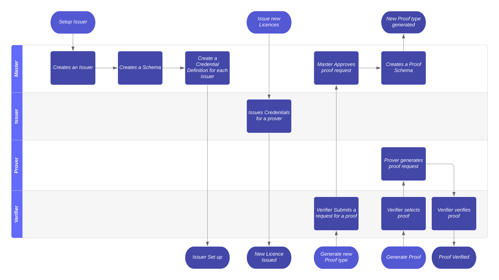

# Clueless
Welcome to Clueless

## Example User Interface Repositoies

### Issuer and Ticketing React Website 


https://github.com/kawmaiparis/clueless-new-frontend/

### Prover React Native Webapp

https://github.com/jake-walker-18/clueless-react-prover

### Verifier React Native Webapp

https://github.com/kawmaiparis/clueless-verifier

## Running Clueless

### Command Line

Clueless has the following command line arguments:
- `--fs` specifies the file system that the program will run using. The following file systems are available:
    - `aws` which uses the AWS file system for storing proofs.
    - `local` which uses your local file system.
    
An example of running the program with command line arguments is as follows: 
`java -jar ./target/api-0.0.1-SNAPSHOT.jar --fs=local`

The default values for these command line arguments can be updated in the `application.properties` file inside the `resources` file.

### AWS

To add AWS support add your aws `access key` and `secret key` to:
 - The `application.properties` file inside the `resources` folder. 
 - The constructor parameters `awsAccessKey` and `awsSecretKey` inside the `test.clueless.api.integrationtest.TestEnv` file. It is recommended to use staging or testing credentials for this.
 
 This is not needed if you are using your local file system. Using AWS allows the API to be stateless.

## System Architecture

### System Diagram


On the left, the Clients (Verifier, Prover...) represent who is responsible for each step of the pipeline. The master is either automated on the server, or should be done when setting up a system. The different clients correspond with the Controller the endpoints will be associated with. 

All of the following operations should be done using the Swagger API at `http://$URI/swagger-ui.html` where you can interactively call the endpoints, however the curl scripts for each stage will be provided.

### Setting up a new Issuer for a Licence

Following the Setup Issuer pipeline, the following endpoints represent what to do at each stage:
1) Creates an Issuer. Master Controller, this returns your $IssuerDiD
```kotlin
@ApiOperation(value = "Creates a new issuer for the given ID and Key pair")
@ApiResponses(value = [
    ApiResponse(code = 201, message = "DiD for the issuer with the given ID, key pairing"),
    ApiResponse(code = 409, message = "Error Issuer already exists"),
    ApiResponse(code = 422, message = "Error processing request")
])
@PutMapping("create-issuer")
fun createIssuer(
        walletId: String,
        walletKey: String
): ResponseEntity<String?>
```
```shell script
curl -X PUT "http://$URI/create-issuer?walletId=$issuerID&walletKey=$issuerKey" -H "accept: */*"
```
2) Creates a schema. Master, this returns $schemaId
```kotlin
@ApiOperation(value = "Creates a new credential schema for the Issuer")
@ApiResponses(value = [
    ApiResponse(code = 201, message = "Credential Schema ID for the given licence"),
    ApiResponse(code = 404, message = "Error user does not exist"),
    ApiResponse(code = 403, message = "Error incorrect id-key pair"),
    ApiResponse(code = 409, message = "Error user is already performing an operation"),
    ApiResponse(code = 422, message = "Error processing request")
])
@PutMapping("create-credential-schema")
fun createCredSchema(
        defaultStewardDid: String?,
        walletId: String,
        walletKey: String,
        licence: Licences
): ResponseEntity<String?>
```
```shell script
curl -X PUT "http://$URI/create-credential-schema?defaultStewardDid=$IssuerDiD&licence=$licence&walletId=id&walletKey=key" -H "accept: */*"
```
Where licences are defined in `licences.Licence`, if using swagger-ui you can select your licence from a dropdown. An example of this is `DRIVINGLICENCE`
3) Create a Credential Definition for Each User. Master, this returns a $credDefID
```kotlin
@ApiOperation(value = "Create a credential definition for the issuer to reference the schema")
@ApiResponses(value = [
    ApiResponse(code = 201, message = "Credential Definition ID for the given issuer and schema"),
    ApiResponse(code = 404, message = "Error user does not exist"),
    ApiResponse(code = 403, message = "Error incorrect id-key pair"),
    ApiResponse(code = 409, message = "Error user is already performing an operation"),
    ApiResponse(code = 422, message = "Error processing request")
])
@PutMapping("create-credential-definition")
fun createCredentialDefinition(
        walletId: String,
        walletKey: String,
        personDid: String,
        schemaId: String
): ResponseEntity<String?>
```
```shell script
curl -X PUT "http://$URI/create-credential-definition?personDid=$issuerDiD&schemaId=$schemaID&walletId=$issuerID&walletKey=$issuerKey" -H "accept: */*"
```
```shell script
issuerDiD = curl -X PUT "http://localhost:8080/create-issuer?walletId=issuer&walletKey=issuerKey" -H "accept: */*"
schemaId = curl -X PUT "http://localhost:8080/create-credential-schema?defaultStewardDid=$IssuerDiD&licence=DRIVINGLICENCE&walletId=issuer&walletKey=issuerKey" -H "accept: */*"
curl -X PUT "http://localhost:8080/create-credential-definition?personDid=$issuerDiD&schemaId=$schemaID&walletId=issuer&walletKey=issuerKey" -H "accept: */*"
```


### Issuing a New Licence to a Client
Issuing a ticket credential to a prover. The same process is repeated for Driving Licences.
```kotlin
@ApiOperation(value = "Issues a ticket to a prover, emailing the response")
@ApiResponses(value = [
    ApiResponse(code = 201, message = "The credentials were emailed."),
    ApiResponse(code = 404, message = "Error issuer not found"),
    ApiResponse(code = 403, message = "Error incorrect id-key pair"),
    ApiResponse(code = 409, message = "Error user is already performing an operation"),
    ApiResponse(code = 422, message = "Error processing request")
])
@PutMapping("create-email-ticket")
fun issuerEmailCreatedTicketCredentials(
        email: String,
        issuerWalletId: String,
        issuerWalletKey: String,
        proverWalletId: String,
        proverWalletKey: String,
        credDefId: String,
        name: String,
        ticketLevel: String,
        issuerDid: String? = null,
        proverDid: String? = null
): ResponseEntity<String?>
```
```shell script
curl -X PUT "http://$URI/create-email-ticket?credDefId=$credDefID&email=$email&issuerDid=$issuerDiD&issuerWalletId=$issuerWalletID&issuerWalletKey=$issuerWalletKey&proverDid=$proverDiD&proverWalletId=$proverWalletID&proverWalletKey=$proverWalletKey&name=$name&ticketLevel=$ticketLevel" -H "accept: */*"
```

The master secret ID and DID of the new Prover are emailed to the email address supplied, these are `$proverMasterSecretID` and `$proverDiD`

An example execution is
```shell script
curl -X PUT "http://localhost:8080/create-email-ticket?credDefId=Th7MpTaRZVRYnPiabds81Y%3A3%3ACL%3A10%3ATag1&email=example%40email.com&issuerDid=UrZPgMsBqhZwGyrnAt74nA&issuerWalletId=issuer&issuerWalletKey=issuerKey&name=Sam&proverWalletId=sam&proverWalletKey=samKey&ticketLevel=1" -H "accept: */*"
```

### Generating a Proof

Generates a proof for a specific proof type to be given to a prover. 
```kotlin
@ApiOperation(value = "Creates a proof request for the prover stored on the file system S3")
@ApiResponses(value = [
    ApiResponse(code = 201, message = "The location of the file on the file system, " +
            "for S3 this is in two parts the bucket name and object name; otherwise this value should be the " +
            "object name given to the Verifier."),
    ApiResponse(code = 404, message = "Error prover not found"),
    ApiResponse(code = 403, message = "Error incorrect id-key pair"),
    ApiResponse(code = 409, message = "Error user is already performing an operation"),
    ApiResponse(code = 422, message = "Error processing request")
])
@GetMapping("credentials-for-default-proof")
fun proverGetDefaultCredentials(
        proverDID: String,
        proverWalletKey: String,
        proverWalletID: String,
        masterSecretId: String,
        proof: String
): ResponseEntity<String?>
```

```shell script
curl -X GET "http://$URI/credentials-for-default-proof?masterSecretId=$proversMasterSecretID&proof=$proofType&proverDID=$proverDID&proverWalletID=$proverWalletID&proverWalletKey=$proverWalletKey" -H "accept: */*"
```

The location of the proof on the servers File System is returned from this, and this location is what should be passed as the `$fileLocation`, if the file system is s3 then `$bucketName` will also be returned from this endpoint. 

A list of available proofs is available through 
```kotlin
@ApiOperation(value = "A list of available proofs for a licence")
@GetMapping("get-proofs")
fun getProofs(licence: String): List<String> 
```
```shell script
curl -X GET "http://$URI/get-proofs?licence=$licence" -H "accept: */*"
```

The proof string should be exactly the same as the one returned by this endpoint.

An example execution is 
```shell script
proofType = curl -X GET "http://localhost:8080/get-proofs?licence=Driving%20Licence" -H "accept: */*"[0]
curl -X GET "http://localhost:8080/credentials-for-default-proof?masterSecretId=979850bb-5b0c-4f53-a9af-d58db8166941&proof=$proofType&proverDID=Th7MpTaRZVRYnPiabds81Y&proverWalletID=Sam&proverWalletKey=SamKey" -H "accept: */*"
```

### Verifying a Proof

Verifys a proof from the File System 
```kotlin
@ApiOperation(value = "Verifies a proof for the verifier using a proof stored on the File System")
@ApiResponses(value = [
    ApiResponse(code = 201, message = "The status of the verification", response = Boolean::class),
    ApiResponse(code = 400, message = "File System error"),
    ApiResponse(code = 404, message = "Error objectName-bucketName pairing not found"),
    ApiResponse(code = 403, message = "Error incorrect id-key pair"),
    ApiResponse(code = 409, message = "Error user is already performing an operation"),
    ApiResponse(code = 422, message = "Error processing request")
])
@GetMapping("prove-s3")
fun verifyProofFromS3(
        name: String,
        verifierDid: String,
        verifierWalletKey: String,
        verifierWalletId: String,
        bucketName: String?,
        objectName: String,
        proof: String
): ResponseEntity<*>
```
```shell script
curl -X GET "http://$URI/prove-s3?bucketName=$bucketName&name=$name&objectName=$fileLocation&proof=$proofType&verifierDid=$verifierDiD&verifierWalletId=$verifierWalletID&verifierWalletKey=$verifierWalletKey" -H "accept: */*"
```
An example execution of this would be
```shell script
curl -X GET "http://localhost:8080/prove-s3?name=Sam&objectName=.%2Fproof.json&proof=Person%20is%20over%20the%20age%20of%2018&verifierDid=Th7MpTaRZVRYnPiabds81Y&verifierWalletId=verifierWalletID&verifierWalletKey=verifierWalletKey" -H "accept: */*"
```

### Debugging
If you get a 409 error that the user is already performing the operation then that means the users wallet is already open. To resolve this call the following endpoint:
```kotlin
@ApiOperation(value = "Closes a wallet inside the distributed ledger, " +
        "this must be done before another operation can be complete")
@ApiResponses(value = [
    ApiResponse(code = 201, message = "The status of the closing of the wallet"),
    ApiResponse(code = 400, message = "Error closing wallet"),
    ApiResponse(code = 422, message = "Error processing request")
]) 
@DeleteMapping("close-wallet")
fun closeWallet(
        wallet: Wallet
): ResponseEntity<String?>
```
```shell script
curl -X DELETE "http://$URI/close-wallet?walletHandle=1" -H "accept: */*"
```

## Developer
### System Architecture


### Add New Proof
To add a new proof you need to add the new proof to `proofs.Proofs` following the structure: 
- `proofName` which is the name of the proof given to the client
- `proof` which is a constructor for the proof JSON (see documentation) 
- `type` this is an instance of the classes that can see generate the proof. E.g: any Identification Licence (Driving License for example) can create a proof based on your age, so we use the IdentificationLicence for the type.

The type means that if we add the proof to the Identification Licence all types of Identification Licences will be able to use this proof. 

### Add a New Licence

To add a new Licence
1) Create a new Licence class which inherits from the correct licence type, at a minimum your licence must inherit from `Licence` but it is a recommended to inherit from `LicenceImpl`. E.g: A Driving Licence will inherit from `Identification` Licence. This must override the following methods:
   - `getProofs()` which adds all proofs specific to your licence. 
   ```
   override fun getProofs(): MutableList<Proofs> {
       val proofs = super.getProofs()
           proofs.addAll(0,
               Proofs.values()
                   .filter { it.type.javaClass == YOUR_LICENCE::class.java }
           )
       return proofs
   }
      ``` 
   - `getCredentialsJSON()` which allows us to create credentials for this licence, you should add a put for every attribute added
   ```
    override fun getCredentialsJSON(): JSONObject {
        return super.getCredentialsJSON()
            .put("YOUR_ATTRIBUTE_NAME", Gson().toJson(Attribute(YOUR_ATTRIBUTE)))
    }
    ```
   - `getSchemaJSON()` which allows us to create schemas for this attribute, add a put for each new attribute
   ```
    override fun getSchemaJSON(): JSONArray {
        return super.getSchemaJSON().put("YOUT_ATTIBUTE_NAME")
    }
   ```
2) Add the licence to the Licences enum in `licences.Licences` of the structure: 
    - `licence` which is the name of the licence which will be exposed to the client.
    - `type` which is an instance of your new Licence. 